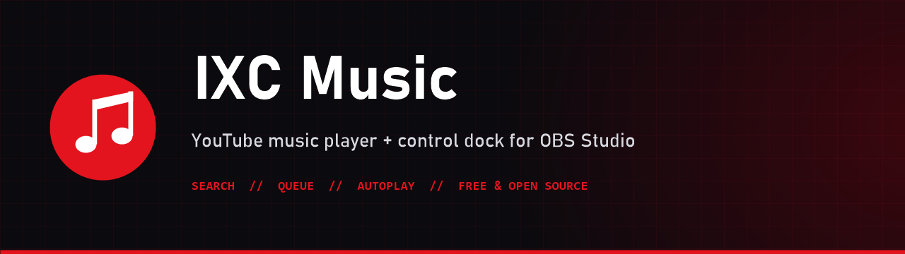
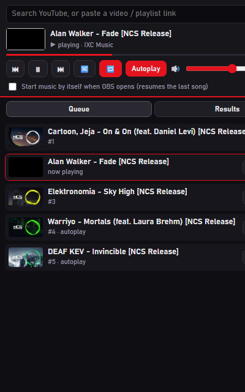

<div align="center">



[](https://github.com/infernoxc/ixc-music/releases/latest)
[](https://github.com/infernoxc/ixc-music/actions/workflows/ci.yml)
[](LICENSE)


**A free, lightweight YouTube music player that lives inside OBS Studio.**<br>
Search and queue songs from an OBS dock. The music plays through a normal OBS audio source, so you decide which audio tracks it goes to.

[**⬇ Download the latest release**](https://github.com/infernoxc/ixc-music/releases/latest) · [Install guide](docs/INSTALL.md) · [How to use](docs/USAGE.md) · [Troubleshooting](docs/TROUBLESHOOTING.md)

</div>

---



## Features
- 🔎 **Search YouTube from OBS.** No API key, no account.
- 🔗 **Paste links:** a video, a playlist, or an 11-character video ID.
- 📜 **Queue:** play now, add, move up, remove, and play from any position.
- 🔀 **Shuffle** and 🔁 **repeat**.
- ♾️ **Autoplay:** when the queue ends, similar songs keep playing (music only: no mixes, live streams or videos longer than 12 minutes).
- ▶️ **Start with OBS** *(optional)*: resumes the last song where it stopped.
- 🛟 **Robust playback:** unexpected pauses resume by themselves, and blocked or removed videos are skipped with the reason shown.
- 🎚️ **You control the audio:** the player is a normal OBS audio source (tracks, monitoring, filters).
- 🪶 **Light:** a tiny local helper plus one browser source. Nothing is downloaded; it uses YouTube's official embedded player.

<br clear="right">

## Requirements
| | |
|---|---|
| Windows | 10 or 11 (Windows PowerShell 5.1 and .NET Framework 4.8 are built in) |
| OBS Studio | 30 or newer, with browser sources and custom docks |
| Internet | Needed for YouTube |
| Tested on | Windows 11 (build 26200) with OBS Studio 32.2.2. Other versions aren't tested yet. [Tell us](https://github.com/infernoxc/ixc-music/issues) if it works for you. |

## Install
1. Download **`IXC-Music-vX.Y.Z.zip`** (portable) or **`IXC-Music-Setup-vX.Y.Z.exe`** (installer) from [Releases](https://github.com/infernoxc/ixc-music/releases/latest).
2. Close OBS. Unzip and double-click **`Install.bat`**, or run the Setup `.exe`. No admin rights needed.
3. In OBS, add the **browser source** and the **dock**:

| Add in OBS | URL | Settings |
|---|---|---|
| Sources › + › **Browser**: "IXC Music Player" | `http://localhost:8767/music/player.html` | 320×180, ✅ Control audio via OBS, custom FPS **30**, keep visible (move it off-canvas) |
| Docks › **Custom Browser Docks**: "IXC Music" | `http://localhost:8767/music/dock.html` | |

The full guide with audio-track setup is in **[docs/INSTALL.md](docs/INSTALL.md)**.

## Documentation
[Install](docs/INSTALL.md) · [Usage](docs/USAGE.md) · [Configuration](docs/CONFIGURATION.md) · [Troubleshooting](docs/TROUBLESHOOTING.md) · [Update and uninstall](docs/UNINSTALL.md) · [Architecture and API](docs/ARCHITECTURE.md) · [Releasing](docs/RELEASING.md)

## Build from source
```powershell
git clone https://github.com/infernoxc/ixc-music.git
cd ixc-music
powershell -ExecutionPolicy Bypass -File tests\smoke.ps1 -Online     # tests
powershell -ExecutionPolicy Bypass -File scripts\install.ps1         # install from source
powershell -ExecutionPolicy Bypass -File build\build.ps1 -Installer  # dist\ ZIP + Setup.exe (needs Inno Setup 6)
```
No build step for the app itself: it's plain PowerShell, HTML and JavaScript.

## ⚠️ Music copyright
Most commercial songs are copyrighted. Streaming them can get VODs muted or your channel struck. Use music that's
licensed for streaming (for example **NCS** or **StreamBeats**), and follow your platform's rules.

## Works great with
**[IXC ChatBox](https://github.com/infernoxc/ixc-chatbox)**: Twitch, Kick and YouTube chat in one OBS dock, with replies and neural TTS. Both share the same small helper.

## License and credits
Code © 2026 **Ishan (InFerNoxC)**, released under the [MIT License](LICENSE).
This project uses YouTube's embedded player and public pages, and runs inside OBS Studio. Those belong to their owners
and have their own terms: see [THIRD-PARTY-NOTICES.md](THIRD-PARTY-NOTICES.md). Not affiliated with or endorsed by
YouTube/Google or the OBS Project.

<div align="center"><sub>Made by <a href="https://github.com/infernoxc">InFerNoxC</a>, built for streamers who want music without losing FPS.</sub></div>
